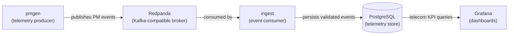
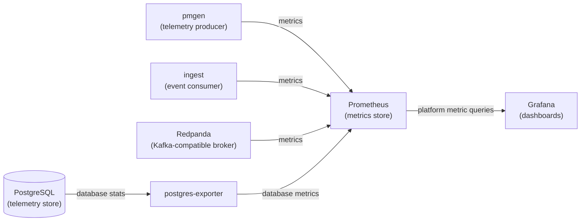
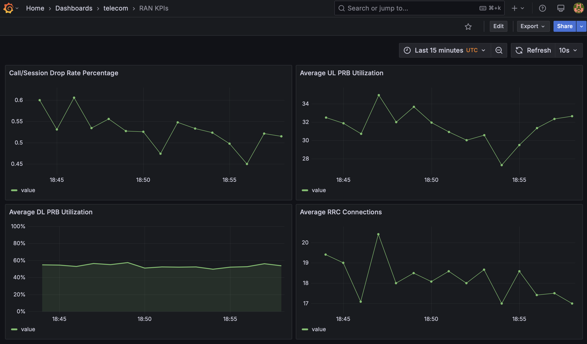
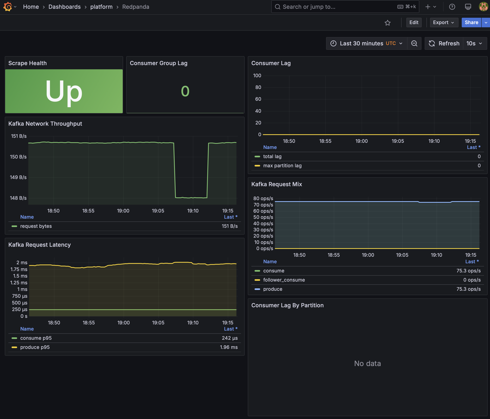

# Cloud-Native Telecom Analytics Platform

## Purpose

The Cloud-Native Telecom Analytics project is a hands-on
professional-development initiative to design, build, deploy, and operate a
telecom analytics platform, focusing on cloud-native architecture and modern
engineering practices.

The project delivers an analytics platform that ingests simulated telecom
telemetry, processes and stores the ingested data, and presents the resulting
analytics through visual dashboards for monitoring and analysis. The project
also provides operational support for the platform itself: collecting metrics,
logs, and tracing data from platform services, and presenting that operational
data for monitoring and analysis.

The project demonstrates practical skills in:

- **AI-assisted engineering**: disciplined use of AI as a development partner,
  combined with human technical judgment, validation, and ownership

- **Architecture**: microservices design, APIs, event-driven communication,
  and distributed-system integration

- **Development practices**: version control, documentation, code review, and
  iterative software development workflows

- **Verification and delivery**: automated testing, smoke testing, and
  CI/CD-oriented validation workflows

- **Deployment**: containerization, orchestration, scaling, configuration
  management, and infrastructure automation

- **Operations**: monitoring, observability, troubleshooting, dashboards, and
  production-style operational support

See [Project Charter](docs/project-charter.md) for scope and goals.


## High-Level Architecture

The telecom telemetry data is processed through an event pipeline, shown here:



Operational metrics are provided by Prometheus and Grafana, as shown here:




For the complete architecture description, see
[Architecture](docs/architecture.md).

## Repository Layout

A summary view of the repository layout is shown below.

    .
    ├── docs
    ├── infra
    │   ├── compose
    │   ├── db
    │   ├── grafana
    │   ├── prometheus
    │   └── redpanda
    ├── services
    │   ├── ingest
    │   │   ├── docs
    │   │   ├── src
    │   │   └── test
    │   └── pmgen
    │       ├── docs
    │       └── src
    └── tests
        └── smoke

The `docs` directory contains system-level documentation, including a runbook
and architecture design document.

The `infra` directory contains configuration and other information that
pertain to components that are not source code projects.

The `services` directory contains the subprojects created specifically for
this project. These services have a `src` subdirectory that contains the
subproject's source code.

The `tests` directory contains code and configuration for system-level tests.

## Quick Start

The analytics platform runs in Docker containers orchestrated by Docker Compose.

**Prerequisites**

  - GitHub repository cloned locally.
  - TCP ports available on localhost:
    - 3000 (ingest)
    - 3001 (Grafana)
    - 8000 (pmgen)
    - 9090 (Prometheus)
    - 9187 (postgres-exporter)
    - 19092 (Redpanda)
    - 9644 (Redpanda)
  - Docker Desktop installed.

**Start Up**

From the project root directory:

```bash
docker compose -f infra/compose/compose.yaml up -d --build
```

**View Dashboards**

  - Grafana URL: `http://localhost:3001`
  - Default Grafana credentials: `admin` / `admin`

**Shut Down**

From the project root directory:

```bash
docker compose -f infra/compose/compose.yaml down
```

## Screenshots

Below is a screenshot of the RAN KPI dashboard in Grafana.



Below is a screenshot of the Redpanda dashboard in Grafana.


