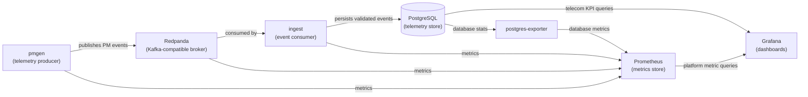
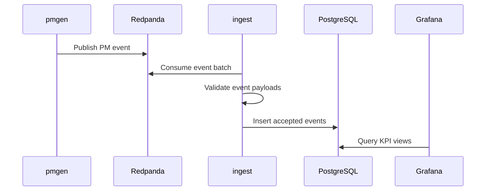
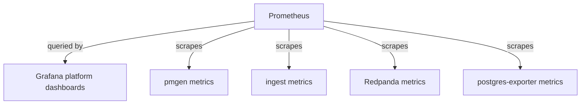

# Architecture

## 1. Purpose

The Cloud-Native Telecom Analytics platform is a production-style portfolio
system for ingesting simulated telecom performance-management telemetry,
storing it for analysis, and exposing both domain analytics and platform health
through dashboards.

The project is not intended to integrate with a real telecom network. Its
purpose is to demonstrate cloud-native service boundaries, event-driven
ingestion, persistence, observability, and operational practices in a system
that resembles a realistic telecom analytics workload.

## 2. Scope

The current architecture covers the local development deployment of the
analytics platform. The same service boundaries are intended to evolve toward
Kubernetes and AWS-hosted infrastructure in later work.

In scope:

- Synthetic telecom PM event generation.
- Event-driven ingestion through a Kafka-compatible broker.
- Raw event persistence in PostgreSQL.
- SQL-based KPI views for Grafana analytics.
- Platform observability through Prometheus and Grafana.
- Local orchestration through Docker Compose.

Out of scope for the current architecture:

- Real network element integration.
- Carrier-grade availability, scale, or compliance.
- Multi-broker Redpanda clustering.
- Schema registry.
- Exactly-once stream processing semantics.
- Advanced stream processing or lakehouse storage.
- Production secret management.

## 3. System Overview

The platform has two related but distinct responsibilities:

- Telecom analytics: show the state of the simulated telecom network.
- Platform observability: show the health of the analytics platform itself.

The primary event path is:

**pmgen -> Redpanda -> ingest -> PostgreSQL -> Grafana**

The operational metrics path is:

**services and exporters -> Prometheus -> Grafana**

## 4. Component Boundaries

### 4.1 pmgen

`pmgen` is the synthetic telemetry producer. It models a fleet of telecom cells
and emits performance-management events at a configured interval.

Architectural responsibilities:

- Generate realistic-enough telecom PM samples for the demo domain.
- Publish events to the broker using the agreed event schema.
- Expose producer health and delivery metrics.

`pmgen` owns simulation behavior. It does not own persistence, dashboard logic,
or downstream retry behavior after events are accepted by the broker.

### 4.2 Redpanda

Redpanda is the Kafka-compatible event broker. It decouples event production
from event ingestion and gives the platform a durable backlog boundary.

Architectural responsibilities:

- Accept telemetry events from producers.
- Retain events long enough for consumers to recover from temporary failures.
- Expose broker and consumer-group metrics for operational visibility.

The current local deployment uses a single broker instance. This is appropriate
for local development, but it is not a high-availability broker architecture.

### 4.3 ingest

`ingest` is the event ingestion service. It consumes events from Redpanda,
validates payloads, and writes accepted events to PostgreSQL.

Architectural responsibilities:

- Consume from the telemetry topic as part of a named consumer group.
- Validate event structure before persistence.
- Write accepted events to the database.
- Preserve idempotency through database constraints.
- Expose consumer health, processing, and lag metrics.

`ingest` is the owner of consumer-side delivery behavior. In the current design,
the intended semantic is at-least-once delivery with idempotent database writes.

### 4.4 PostgreSQL

PostgreSQL is the system of record for ingested telecom telemetry in the current
architecture.

Architectural responsibilities:

- Store raw PM events.
- Enforce event idempotency by event identifier.
- Provide queryable KPI views for analytics dashboards.

The current architecture intentionally keeps storage simple. PostgreSQL is
sufficient for the local portfolio workload and keeps the system explainable.
Future OLAP or lakehouse storage should be introduced only when the project has
a clear requirement that PostgreSQL no longer satisfies.

### 4.5 Prometheus

Prometheus is the platform metrics collector and time-series store for
operational telemetry.

Architectural responsibilities:

- Scrape application and infrastructure metrics.
- Store recent operational time-series data.
- Provide the metrics datasource for Grafana platform dashboards.

Prometheus is used for platform observability, not as the primary store for
telecom PM event data.

### 4.6 Grafana

Grafana is the visualization layer for both telecom analytics and platform
observability.

Architectural responsibilities:

- Query PostgreSQL for telecom analytics dashboards.
- Query Prometheus for platform dashboards.
- Present system behavior in a way that supports demo, troubleshooting, and
  operational explanation.

The architecture keeps these two dashboard concerns separate because they answer
different questions. Telecom dashboards explain the simulated network;
platform dashboards explain the analytics system.

### 4.7 postgres-exporter

`postgres-exporter` bridges PostgreSQL operational statistics into Prometheus.

Architectural responsibilities:

- Connect to PostgreSQL with a monitoring-oriented user.
- Expose database health and activity metrics to Prometheus.

It does not participate in the telecom event path.

## 5. Event Flow

The event-driven ingestion path is the main data flow through the platform.

The broker does not push events into the ingestion service. The ingestion
service consumes from the broker and controls when offsets are considered
processed. This boundary is important because consumer recovery, duplicate
handling, and backlog behavior are part of the ingestion design.

## 6. Data Architecture

The platform stores raw telemetry events as the durable source of truth.
Derived analytics are computed from the stored event data through SQL views.

The event model is intentionally compact:

- An event identifier for idempotency.
- A schema version for controlled evolution.
- A source identifier.
- An event timestamp.
- An entity type and entity identifier.
- A JSON object of telecom metrics.

PostgreSQL currently stores raw PM events in the `analytics` schema. The
database also exposes KPI-oriented views used by Grafana. Exact table columns,
indexes, constraints, and view definitions belong in the design document and
SQL migrations.

## 7. Observability Architecture

The platform separates domain telemetry from operational telemetry:

- Domain telemetry flows through Redpanda and PostgreSQL.
- Operational telemetry flows through Prometheus.

The platform dashboards should make the event pipeline explainable:

- Is the producer sending events?
- Is the broker available?
- Is the consumer processing events?
- Is consumer lag accumulating?
- Is PostgreSQL available and accepting writes?

The telecom analytics dashboards should make the simulated network explainable:

- How are utilization and load changing over time?
- Which cells are busiest?
- Are drops or other KPI indicators increasing?

## 8. Deployment Topology

The current runtime topology is a single Docker Compose stack. Each major system
boundary runs as its own containerized service:

- `pmgen`
- `redpanda`
- `redpanda-init`
- `ingest`
- `postgres`
- `postgres-exporter`
- `prometheus`
- `grafana`

Docker Compose is the local development and demonstration topology. It is not
the long-term production target. The service boundaries are intentionally kept
close to Kubernetes deployment boundaries so the platform can later move toward
Deployments, Services, managed storage, and cloud-managed infrastructure.

## 9. Key Architectural Decisions

### 9.1 Use an event broker between producer and ingest

The platform uses Redpanda to decouple telemetry production from ingestion.
This introduces broker operation and Kafka client complexity, but it gives the
system a realistic event-driven architecture with buffering, consumer groups,
and pipeline observability.

### 9.2 Keep PostgreSQL as the primary telemetry store

PostgreSQL remains the primary store because it is simple, inspectable, and
sufficient for the current workload. This avoids premature introduction of OLAP,
lakehouse, or specialized time-series storage while preserving a path to evolve
later.

### 9.3 Store raw events before optimizing analytics storage

The platform stores raw PM events and derives KPI views from them. This keeps
the ingestion path simple and provides a durable source for later replay,
backfill, or model changes.

### 9.4 Separate telecom analytics from platform observability

Grafana serves both dashboard types, but the underlying data sources and
questions are separate. PostgreSQL answers telecom analytics questions.
Prometheus answers platform health questions.

### 9.5 Prefer at-least-once delivery with idempotent writes

The current architecture favors understandable reliability semantics:
consumers may process an event more than once, and the database enforces
idempotency through event identifiers. Exactly-once semantics are intentionally
out of scope.

## 10. Quality Attributes

### Operability

Each major service should expose enough health, logs, and metrics to understand
whether the pipeline is running and where failures are accumulating.

### Evolvability

The architecture keeps service responsibilities narrow. The producer,
consumer, broker, store, and dashboard layers can evolve independently as long
as their contracts remain stable.

### Reliability

The current local architecture is designed for recoverability from common
development failures, such as a restarted consumer or database outage. It is
not designed for high availability across hosts or zones.

### Cost Awareness

The system starts with lightweight local components and avoids managed cloud
services until the project has a clear reason to introduce them. This aligns
with the project goal of incremental complexity.

### Explainability

The architecture favors components and data flows that can be explained clearly
in an interview or portfolio walkthrough. Each added component should have a
visible operational or architectural reason to exist.

## 11. Future Evolution

Likely future architecture changes include:

- Kubernetes deployment with health checks, resource limits, and rollout
  behavior.
- AWS infrastructure using managed services where they provide clear value.
- Stronger secret management.
- CI/CD-driven deployment workflows.
- Alerting and SLO-oriented operational dashboards.
- Event replay and dead-letter handling.
- Schema governance for event evolution.
- Storage optimization if PostgreSQL no longer satisfies analytics needs.

These changes should be added when they become current architecture. Historical
sprint and phase documents can remain planning records, but this document should
describe the current intended system.
