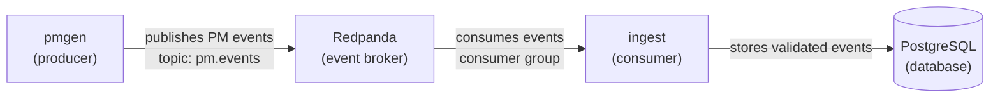
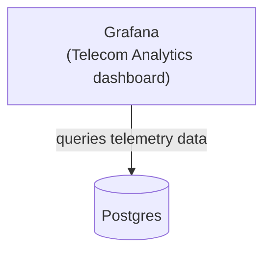
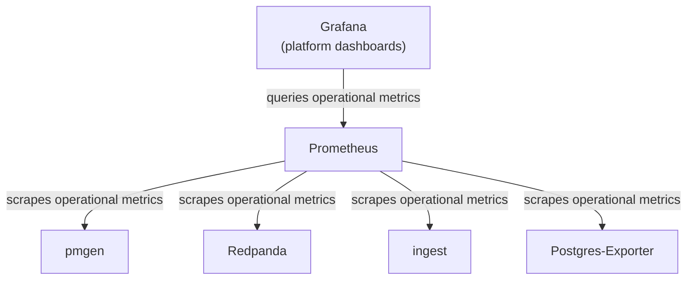

# Cloud-Native Telecom Analytics -- Phase 1

## 1. Overview

Phase 1 introduces **event-driven ingestion** and **basic observability**. The system transitions from a tightly coupled HTTP-to-DB model to a **decoupled, event-driven ingestion pipeline**. The HTTP API remains for compatibility.

**Primary theme:** controlled data flow + operational visibility


## 2. Objectives

### 2.1 Functional Objectives
- Introduce an event broker (Redpanda, Kafka-compatible)
- Transition to event-driven ingestion pipeline:
  - `pmgen → event broker → ingest → Postgres`
- Implement batch-based ingestion
- Preserve existing event schema and DB model

### 2.2 Operational Objectives
- Add system-level observability using Prometheus
- Expose metrics from services
- Extend Grafana dashboards to include pipeline health


## 3. Architecture (Phase 1 Target)

The analytics platform collects telecom telemetry data, stores it, and makes it available
for monitoring.

### 3.1. Event Flow

The generator (pmgen) sends the telemetry data as *events* to the event broker (Redpanda),
which in turn delivers the events to the collector (ingest). The collector stores the
data in an SQL database (Postgres). This event flow is shown in the following diagram. 



The following points provide further details on the components:

  - pmgen
    - Written in Python
    - Generates telecom telemetry (simulated) as events

  - Redpanda
    - Kafka-compatible event broker

  - ingest
    - Written in JavaScript/Node.js/Express
    - Consumes events
    - Stores event data to an SQL database

  - PostgreSQL
    - Stores telecom analytics data
    - Available as a datasource for visualization (Grafana)

<!--

-->

### 3.2. Telecom Analytics Dashboard

The Telecom Analytics dashboard provides information to monitor the (simulated)
telecommunications network. The purpose is distinct from the other platform
dashboards, which support monitoring the analytics platform itself.



### 3.3 Platform Dashboards

Platform dashboards provide information about the analytics platform overall
and the individual services that comprise it.




## 4. Scope

### 4.1 In Scope
- Redpanda deployment via Docker Compose
- Kafka-compatible producer in `pmgen` (Python)
- Kafka-compatible consumer in `ingest` (Node.js)
- Batch database writes
- Prometheus integration
- Grafana dashboard updates

### 4.2 Out of Scope
- Kubernetes deployment
- High availability / clustering
- Schema registry
- Exactly-once semantics
- Advanced stream processing


## 5. System Design


### 5.1 Event Broker

**Technology:** Redpanda (Kafka-compatible)

**Topic Design:**
```
topic: pm.events
````

**Message Format (unchanged):**
```json
{
  "event_id": "uuid",
  "event_time": "ISO8601",
  "entity_id": "string",
  "metrics": { ... }
}
````


### 5.2 pmgen (Producer)

**Responsibilities:**

* Generate synthetic telecom events
* Publish events to event broker's `pm.events` topic

**Configuration:**

* `PMGEN_KAFKA_BROKER`
* `PMGEN_KAFKA_TOPIC`

**Metrics (Prometheus):**

* `pmgen_events_generated_total`
* `pmgen_kafka_events_sent_total`
* `pmgen_kafka_events_failed_total`
* `pmgen_kafka_sends_in_progress`
* `pmgen_kafka_send_duration_seconds`
* `pmgen_kafka_send_errors_total`


### 5.3 ingest (Consumer)

**Responsibilities:**

* Consume events from event broker's `pm.events` topic
* Validate payloads
* Batch insert into Postgres

**Behavior:**

* Poll event broker continuously
* Process in batches (configurable)
* Provide at-least-once delivery semantics
* Commit consumer offsets only after validated events are durably written to Postgres
* Leave offsets uncommitted when Postgres writes fail so the event broker can redeliver after recovery
* Use `ON CONFLICT DO NOTHING` for idempotency

**Configuration:**

* `BROKER_URL`
* `TOPIC_NAME`
* `BATCH_SIZE` (default: 100)
* `POLL_INTERVAL_MS` (default: 500)

**Metrics (Prometheus):**

* `ingest_events_inserted_total`
* `ingest_events_rejected_total`
* `ingest_kafka_messages_processed_total`
* `ingest_kafka_batch_duration_seconds`
* `ingest_consumer_lag`


### 5.4 Postgres

No schema changes required.

**Existing guarantees leveraged:**

* Primary key on `event_id`
* JSONB metrics storage
* Append-only design


### 5.5 Observability

#### Prometheus

* Scrapes metrics endpoints from:

  * ingest (/metrics)
  * pmgen (/metrics)
  * redpanda (/public_metrics)
  * postgres-exporter

#### Grafana (extensions)

* ingestion rate
* consumer lag
* DB insert latency


## 6. Docker Compose Changes

### 6.1 New Services

* `postgres-exporter` - exports metrics for postgres
* `redpanda` - event broker
* `redpanda-init` - creates pm.events topic
* `prometheus` - metrics collector

### 6.2 Updated Services

* `pmgen` - becomes event producer
* `ingest` - becomes event consumer
* `grafana` - adds platform metrics


## 7. Implementation Plan

### Step 1 — Add Event Broker

* Add Redpanda container to compose
* Verify topic creation and connectivity


### Step 2 — Implement Consumer (ingest)

* Add Kafka client library (Node.js)
* Implement polling loop
* Add batch insert logic


### Step 3 — Implement Producer (pmgen)

* Add Kafka client library (Python)
* Publish events to topic
* Validate event flow via logs


### Step 4 — Add Metrics Endpoints

* Integrate Prometheus client libraries
* Expose `/metrics` endpoints

#### Step 4.1 Redpanda

  * Scrape metrics from Admin API port (default: 9644) at endpoint /public_metrics 
  * Decide which metrics to monitor

#### Step 4.2 Postgres

 * Add postgres-exporter container to Docker Compose
 * Decide which metrics to monitor

#### Step 4.3 Pmgen

  * Decide the metrics to expose
  * Integrate client library and expose metrics

#### Step 4.4 Ingest

  * Decide the metrics to expose
  * Integrate client library and expose metrics

### Step 5 — Add Prometheus

  * Configure scrape targets
  * Validate metric collection


### Step 6 — Update Grafana

  * Build out Grafana dashboards

    - Platform dashboards
    - Telecom Analytics dashboard

* Add dashboards for:

  * ingestion throughput
  * processing latency
  * consumer lag


### Step 7 — Failure Testing

* Stop Postgres → verify retry behavior
* Stop ingest → verify backlog accumulation
* Restart services → verify recovery


## 8. Testing Strategy

### 8.1 Functional Tests

* Events flow end-to-end
* No data loss under normal operation

### 8.2 Failure Scenarios

* DB unavailable
* Consumer restart
* Producer burst load

### 8.3 Observability Validation

* Metrics visible in Prometheus
* Dashboards reflect system state


## 9. Risks and Mitigations

| Risk                          | Mitigation                                                     |
| ----------------------------- | -------------------------------------------------------------- |
| Kafka client complexity       | Use well-supported libraries (kafkajs, confluent-kafka-python) |
| Message loss due to misconfig | Use safe producer/consumer defaults                            |
| Resource usage (local dev)    | Tune Redpanda (low memory mode)                                |
| Silent failures               | Add logging + metrics early                                    |


## 10. Deliverables

* Updated `compose.yaml` (Phase 1)
* pmgen producer implementation
* ingest consumer implementation
* Prometheus configuration
* Grafana dashboard updates
* Updated README with architecture and run instructions


## 11. Exit Criteria

Phase 1 is complete when:

* Full pipeline runs locally with a single command
* pmgen publishes events
* ingest consumes events and writes to Postgres
* System tolerates restarts without data loss
* Metrics are visible in Prometheus
* Grafana displays both:

  * telecom metrics
  * platform metrics


## 12. Stretch Goals (Optional)

* Dead-letter queue
* Topic partitioning by `entity_id`
* Replay capability (offset reset)
* Basic schema validation layer
