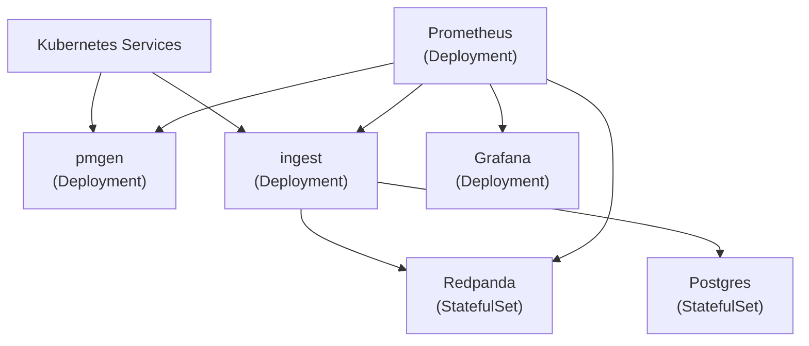
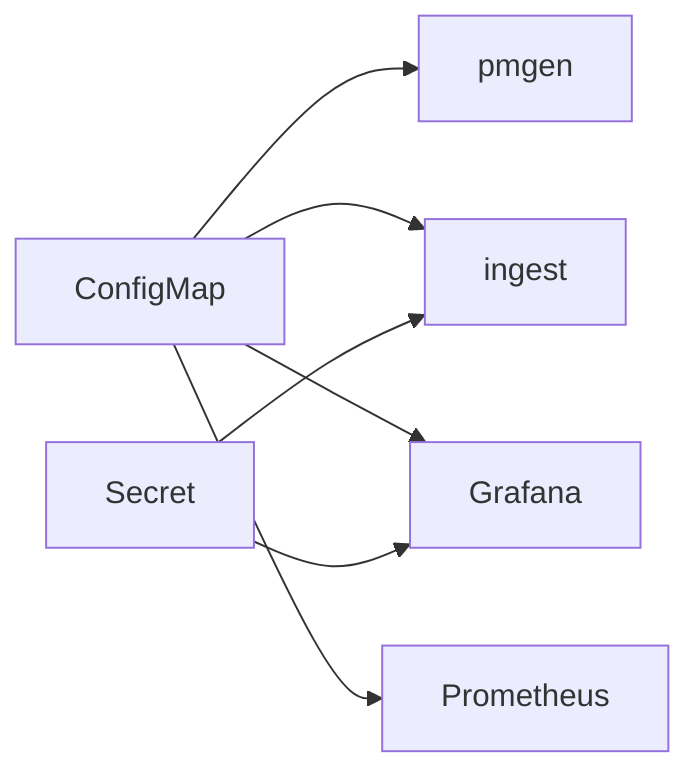
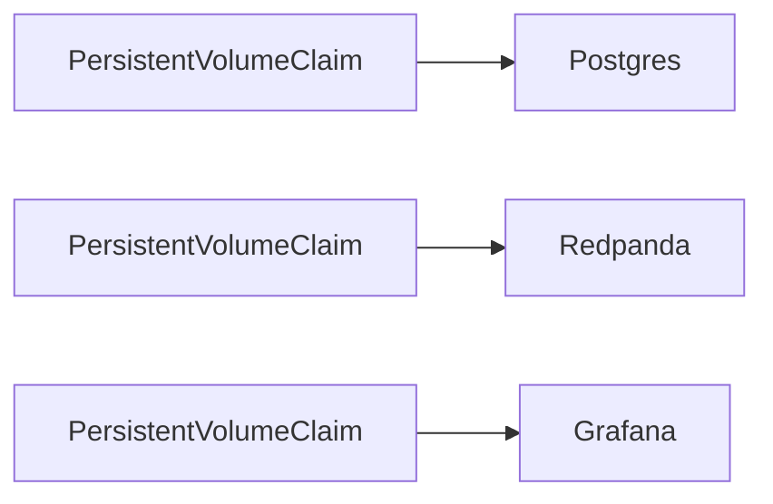

# Cloud-Native Telecom Analytics -- Sprint 2

## 1. Overview

Sprint 2 introduces **Kubernetes-based deployment** and **deployment automation**. The platform transitions from a Docker Compose–centric development environment to a **production-style orchestration model** using Kubernetes.

The existing Docker Compose environment remains the primary local development workflow, while Kubernetes becomes the primary deployment and operational target.

**Primary theme:** orchestration + deployment automation

## 2. Objectives

### 2.1 Functional Objectives

  - Deploy all core platform services to Kubernetes
  - Preserve existing event-driven architecture:
    - `pmgen → Redpanda → ingest → Postgres`
  - Preserve existing observability stack:
    - Prometheus
    - Grafana
  - Maintain compatibility with existing Docker Compose workflows

### 2.2 Operational Objectives

  - Introduce Kubernetes-native deployment artifacts
  - Externalize configuration and secrets
  - Add automated CI validation pipelines
  - Improve deployment reproducibility
  - Validate service restart and recovery behavior in Kubernetes

## 3. Architecture (Sprint 2 Target)

The overall analytics platform architecture remains unchanged. Sprint 2 focuses on how the platform is deployed and operated.

### 3.1 Platform Deployment Architecture

The analytics platform runs inside a Kubernetes cluster using Kubernetes-native resources.



### 3.2 Configuration Architecture

Configuration and secrets are externalized using Kubernetes-native mechanisms.



### 3.3 Persistent Storage

Persistent services retain state using Kubernetes persistent volumes.



## 4. Scope

### 4.1 In Scope

  - Kubernetes manifests for all services
  - Kubernetes Services and networking
  - ConfigMaps and Secrets
  - PersistentVolumeClaims
  - Health probes
  - Local Kubernetes deployment
  - GitHub Actions CI workflows
  - Automated smoke testing
  - Kubernetes deployment documentation

### 4.2 Out of Scope

  - AWS deployment
  - Terraform
  - Helm packaging
  - Multi-node Kubernetes clusters
  - Autoscaling
  - Service mesh
  - Distributed tracing
  - High availability clustering
  - GitOps workflows

## 5. System Design

### 5.1 Kubernetes Environment

**Target Environment:**

  - Docker Desktop Kubernetes

  or

  - kind/k3d

**Deployment Characteristics:**

  - Single-node local cluster
  - Developer-focused environment
  - Repeatable deployment workflow

### 5.2 Kubernetes Resources

#### Deployments

The following services deploy as Kubernetes Deployments:

  - pmgen
  - ingest
  - Prometheus
  - Grafana

#### StatefulSets

The following services deploy as StatefulSets:

  - Postgres
  - Redpanda

#### Services

ClusterIP Services provide internal service discovery and networking.

#### PersistentVolumeClaims

Persistent storage is used for:

  - Postgres database storage
  - Redpanda event storage
  - Grafana persistent configuration

### 5.3 Configuration Management

#### ConfigMaps

Configuration externalized to ConfigMaps includes:

  - Prometheus scrape configuration
  - Grafana provisioning
  - Application runtime configuration

#### Secrets

Secrets externalized to Kubernetes Secrets include:

  - Postgres credentials
  - Grafana admin credentials
  - Broker authentication credentials (if later required)

### 5.4 Health Probes

All applicable services implement:

#### Liveness Probes

Detect unrecoverable container failures.

#### Readiness Probes

Prevent traffic routing before services are operational.

#### Startup Probes (optional)

Used for slower-starting services where appropriate.

### 5.5 CI/CD

#### GitHub Actions

CI workflows validate the repository automatically.

##### Build Validation

  - Install dependencies
  - Run linting
  - Run unit tests
  - Run integration tests

##### Container Validation

  - Build container images
  - Validate Dockerfiles

##### Kubernetes Validation

  - Validate Kubernetes manifests
  - Validate YAML formatting
  - Detect invalid Kubernetes resources

#### Image Tagging

Container images tagged consistently using:

  - branch name
  - commit SHA
  - semantic versions (future)

### 5.6 Smoke Testing

A Kubernetes-compatible smoke test validates:

  - end-to-end event flow
  - database persistence
  - metrics exposure
  - dashboard datasource functionality

The smoke test remains compatible with Docker Compose where practical.

### 5.7 Observability Enhancements

#### Logging

Improve operational logging consistency.

Potential improvements:

  - structured logging
  - correlation identifiers
  - improved error context

#### Prometheus Alerts

Introduce basic alerting rules for:

  - ingest consumer lag
  - failed event processing
  - service unavailability
  - Postgres connectivity failures

## 6. Repository Changes

### 6.1 New Directories

```text
infra/
  k8s/
    base/
    overlays/

.github/
  workflows/
```

### 6.2 Kubernetes Manifests

Add Kubernetes manifests for:

  - deployments
  - statefulsets
  - services
  - configmaps
  - secrets
  - persistentvolumeclaims

## 7. Implementation Plan

### Step 1 — Establish Kubernetes Environment

  - Enable local Kubernetes cluster
  - Validate kubectl connectivity
  - Create initial namespace structure
    - The namespaces are telecom-analytics, monitoring, and data-services

### Step 2 — Deploy Stateful Services

  - Deploy Postgres StatefulSet
  - Deploy Redpanda StatefulSet
  - Validate persistence behavior

### Step 3 — Deploy Application Services

  - Deploy ingest
  - Deploy pmgen
  - Validate service discovery
  - Validate end-to-end event flow

### Step 4 — Deploy Observability Stack

  - Deploy Prometheus
  - Deploy Grafana
  - Validate metrics collection
  - Validate dashboard functionality

### Step 5 — Externalize Configuration

  - Convert runtime configuration to ConfigMaps
  - Convert credentials to Secrets
  - Remove hardcoded configuration dependencies

### Step 6 — Add Health Probes

  - Add readiness probes
  - Add liveness probes
  - Validate restart behavior

### Step 7 — Add CI Pipelines

  - Create GitHub Actions workflows
  - Add automated test execution
  - Add Kubernetes manifest validation

### Step 8 — Implement Smoke Testing

  - Deploy smoke-test workflow
  - Validate event persistence
  - Validate observability integration

### Step 9 — Failure Testing

  - Restart pods during operation
  - Verify persistence recovery
  - Verify consumer recovery
  - Verify metrics continuity

## 8. Testing Strategy

### 8.1 Functional Tests

  - Events flow end-to-end in Kubernetes
  - No data loss under normal operation
  - Services restart successfully

### 8.2 Failure Scenarios

  - Pod restart
  - Postgres restart
  - ingest restart
  - Redpanda restart
  - Kubernetes rollout restart

### 8.3 Observability Validation

  - Metrics visible in Prometheus
  - Dashboards function correctly
  - Alerts trigger appropriately

## 9. Risks and Mitigations

| Risk                      | Mitigation                               |
| ------------------------- | ---------------------------------------- |
| Kubernetes complexity     | Introduce concepts incrementally         |
| Persistent storage issues | Use StatefulSets and PVCs early          |
| Configuration sprawl      | Standardize manifest structure           |
| YAML maintenance burden   | Keep manifests modular and organized     |
| Local resource exhaustion | Use lightweight Kubernetes configuration |

## 10. Deliverables

  - Kubernetes manifests
  - Local Kubernetes deployment workflow
  - GitHub Actions workflows
  - Smoke-test framework
  - Updated documentation
  - Deployment instructions
  - Health probe implementation
  - Prometheus alert rules

## 11. Exit Criteria

Sprint 2 is complete when:

  - Entire platform deploys successfully to Kubernetes
  - Services communicate using Kubernetes networking
  - Persistent services retain state across pod restarts
  - GitHub Actions automatically validate builds and tests
  - Smoke tests validate end-to-end functionality
  - Prometheus and Grafana function in Kubernetes
  - Health probes operate correctly
  - Deployment workflow is documented

## 12. Stretch Goals (Optional)

  - Kustomize overlays
  - Helm chart evaluation
  - HorizontalPodAutoscaler experimentation
  - Resource limits and requests
  - Network policies
  - Pod disruption testing
  - Image vulnerability scanning
